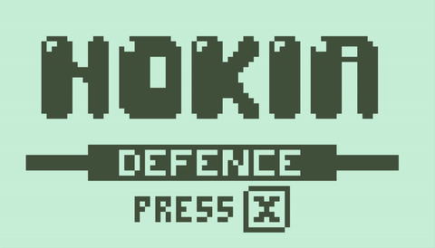

# Nokia Defence

A Tower Defence game for Web and Desktop written as if for the Nokia 3310:

- 84x48 screen resolution
- only 2 colours light/dark green
- monophonic music only
- max 12 buttons allowed

This is a submission for [Nokia 3310 Jam 4](https://itch.io/jam/nokiajam4) made using the [Ebiten](https://ebiten.org/) library.

You can download the published game or play in your browser at: [sinisterstuf.itch.io/nokia-defence][itchio-link]

[][itchio-link]

[][itchio-link]

## For game testers

For alpha testing use this [link to download the latest development build][nightly-link] including Windows EXE, Mac app, Linux binary, as well as other resources for testing and editing.

Game controls:
- WASD: move cursor
- X: (action) place/upgrade a tower (action)
- Q: sell a tower
- Z: pause the game
- F: toggle full-screen

## For programmers

Make sure you have [Go 1.17 or later](https://go.dev/) to contribute to the game

To build the game yourself, run: `go build .` it will produce an nokia-defence file and on Windows nokia-defence.exe.

To run the tests, run: `go test ./...` but there are no tests yet.

The project has a very simple, flat structure, the first place to start looking is the main.go file.

[nightly-link]: https://nightly.link/sinisterstuf/nokia-defence/workflows/build/main/nokia-defence-bundle.zip
[itchio-link]: https://sinisterstuf.itch.io/nokia-defence
